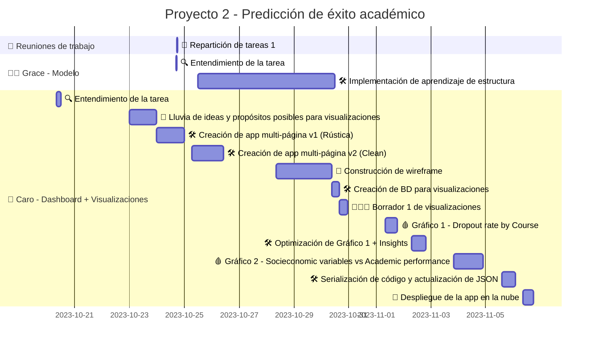

# Modelo de Predicción de Éxito Académico
Esta aplicación es un prototipo que utiliza un modelo de aprendizaje automático para predecir la probabilidad de éxito académico de un estudiante en función de ciertos parámetros socioeconómicos y académicos.

## Avance de Fase 2 del proyecto

## Requisitos
- Python 3.6 o superior
- Instalar las dependencias:
    - `dash`
    - `dash_bootstrap_components`
    - `dash_bootstrap_templates`
    - `fontawesome`
    - `gunicorn`
    - `matplotlib`
    - `pandas`
    - `pgmpy`
    - `psycopg2`
    - `pywaffle`

## Estructura del Proyecto
- `app_folder`: Carpeta "despliegue", correspondiente al Soporte 4 requerido en la Fase 2 del proyecto. 
- `assets/`: Directorio que contiene los recursos utilizados en la interfaz.
    - `custom.css`: Archivo que contiene el estilo personalizado de la aplicación.
    - `logo-deca.png`: Logo creado para el proyecto.
    - `modelo_entrenado.pkl`: Modelo serializado entrenado con los datos de limpios.
    - `parameter_options.JSON`: Archivo JSON con las opciones de los menús desplegables.
- `Pages/`: Carpeta que contiene los archivos de las páginas del dashboard.
    - `home.py`: Archivo que contiene el cuerpo de la página de inicio (app v.1.).
    - `visualizations.py`: Archivo que contiene el cuerpo de la página de visualizaciones.	
- `.gitignore`: Archivo que especifica los archivos que no se deben subir al repositorio.
- `app.py`: Código principal de la aplicación.

