# Modelo de Predicción de Éxito Académico
Esta aplicación es un prototipo que utiliza un modelo de aprendizaje automático para predecir la probabilidad de éxito académico de un estudiante en función de ciertos parámetros socioeconómicos y académicos.

## Avance de Fase 2 del proyecto

```mermaid
gantt
    title Proyecto 2 - Predicción de éxito académico
    dateFormat  YYYY-MM-DD
    section 🐜 Reuniones de trabajo
    💼 Repartición de tareas 1:2023-10-24 17:21,30m
    section 💪🏽 Grace - Modelo
    🔍 Entendimiento de la tarea:2023-10-24 16:30,40m
    🛠️ Implementación de aprendizaje de estructura: 2023-10-25 12:00, 5d
    section 🐴 Caro - Dashboard + Visualizaciones
    🔍 Entendimiento de la tarea:2023-10-20 8:00,4h
    📝 Lluvia de ideas y propósitos posibles para visualizaciones:2023-10-23,1d
    🛠️ Creación de app multi-página v1 (Rústica):2023-10-24,1d
    🛠️ Creación de app multi-página v2 (Clean):2023-10-25 6:30, 28h
    📝 Construcción de wireframe:2023-10-28 8:30, 48.5h
    🛠️ Creación de BD para visualizaciones:2023-10-30 9:10, 7h
    👩🏽‍🎨 Borrador 1 de visualizaciones:2023-10-30 16:10, 7h
    🩸 Gráfico 1 - Dropout rate by Course:2023-11-1 8:20, 10h
    🛠️ Optimización de Gráfico 1 + Insights:2023-11-2 6:50, 13h
    🩸 Gráfico 2 - Socieconomic variables vs Academic performance:2023-11-3 20:00, 26h
    🛠️ Serialización de código y actualización de JSON: 2023-11-5 14:00, 12h
    👑 Despliegue de la app en la nube: 2023-11-6 8:56, 9h
```

## Requisitos
- Python 3.6 o superior
- Instalar las dependencias:
    - `dash`
    - `dash_bootstrap_components`
    - `dash_bootstrap_templates`
    - `fontawesome`
    - `gunicorn`
    - `matplotlib`
    - `pandas`
    - `pgmpy`
    - `psycopg2`
    - `pywaffle`

## Estructura del Proyecto
- `app_folder`: Carpeta "despliegue", correspondiente al Soporte 4 requerido en la Fase 2 del proyecto. 
- `assets/`: Directorio que contiene los recursos utilizados en la interfaz.
    - `custom.css`: Archivo que contiene el estilo personalizado de la aplicación.
    - `logo-deca.png`: Logo creado para el proyecto.
    - `modelo_entrenado.pkl`: Modelo serializado entrenado con los datos de limpios.
    - `parameter_options.JSON`: Archivo JSON con las opciones de los menús desplegables.
- `Pages/`: Carpeta que contiene los archivos de las páginas del dashboard.
    - `home.py`: Archivo que contiene el cuerpo de la página de inicio (app v.1.).
    - `visualizations.py`: Archivo que contiene el cuerpo de la página de visualizaciones.	
- `.gitignore`: Archivo que especifica los archivos que no se deben subir al repositorio.
- `app.py`: Código principal de la aplicación.

