# Modelo de Predicción de Éxito Académico
Esta aplicación es un prototipo que utiliza un modelo de aprendizaje automático para predecir la probabilidad de éxito académico de un estudiante en función de ciertos parámetros socioeconómicos y académicos.

## Avance del proyecto

```mermaid
gantt
    title Proyecto 2 - Predicción de éxito académico
    dateFormat  YYYY-MM-DD
    section 🐜 Reuniones de trabajo
    💼 Repartición de tareas 1:2023-10-24 17:21,30m
    section 💪🏽 Grace - Modelo
    🔍 Entendimiento de la tarea:2023-10-24 16:30,40m
    🛠️ Implementación de aprendizaje de estructura: 2023-10-25 12:00, 5d
    section 🐴 Caro - Dashboard + Visualizaciones
    🔍 Entendimiento de la tarea:2023-10-20 8:00,4h
    🔍 Construcción de wireframe:2023-10-23,1d
    🛠️ Creación de app multi-página:2023-10-24,1d
    💔 Intento de implementación de dcc.Store:2023-10-25 6:30, 6h
```

## Requisitos
- Python 3.6 o superior
- Instalar las dependencias:
    - `Dash`
    - `Dash Bootstrap Components`
    - `Dash Bootstrap Templates`
    - `Pgmpy`

## Uso
1. Completa los parámetros en el formulario de la izquierda.
2. Observa la probabilidad de éxito académico en el gráfico de la derecha.
3. Ajusta los parámetros y observa cómo cambia la probabilidad de éxito académico.

## Estructura del Proyecto
- `assets/`: Directorio que contiene los recursos utilizados en la interfaz.
    - `assets/logo-deca.png`: Logo creado para el proyecto.
    - `assets/modelo_entrenado.pkl`: Modelo serializado entrenado con los datos de limpios.
    - `assets/parameter_options.JSON`: Archivo JSON con las opciones de los menús desplegables.
- `Caro's_files`: Carpeta que contiene archivos de experimentación y apuntes sobre investigación y avance del proyecto.
- `.gitignore`: Archivo que especifica los archivos que no se deben subir al repositorio.
- `app.py`: Código principal de la aplicación.

